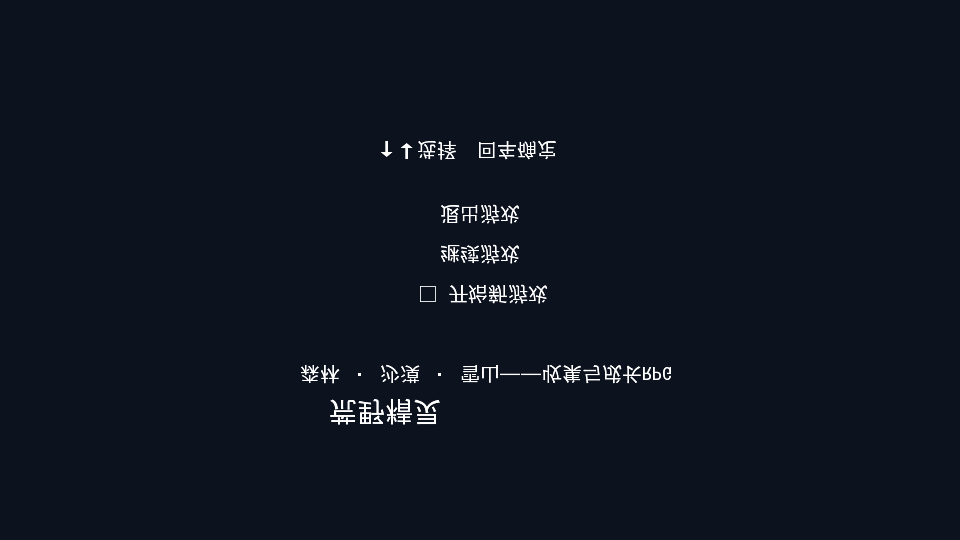
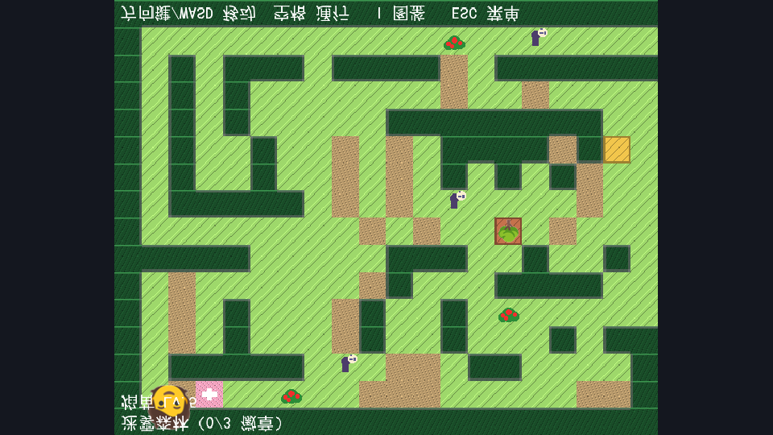

# 荒野精灵（Wild Spirit）

> **Wild Spirit — A Monster-Collecting RPG**：一款宝可梦类单机养成 RPG，基于 Java + LibGDX，包含三大区域探索、精灵捕捉养成、回合制战斗与本地存档。

基于 Java + LibGDX 开发的“宝可梦类”单机养成 RPG。在迷雾森林、烈日沙漠、极寒雪山三大区域捕捉精灵、练级进化、挑战区域头目，集齐三枚徽章通关。支持本地存档，开箱即玩。

## 功能特性

- ✅ 三大区域探索（迷雾森林 → 烈日沙漠 → 极寒雪山），每区一头目，集齐徽章解锁下一区域
- ✅ 25 只精灵：升级、进化（含初始精灵进化链）、图鉴收集（已捕获 / 已见 / 未见）
- ✅ 回合制战斗：技能 PP 次数、9 系属性克制、捕捉 / 换宠 / 道具 / 逃跑
- ✅ 5 种状态异常：中毒、灼伤、麻痹、睡眠、冰冻（含属性免疫规则）
- ✅ 地图交互：树果拾取（+回复药）、治疗师回血回 PP、NPC 对话剧情
- ✅ 本地存档 / 读档（ESC 手动保存 + 过区域 / 击败头目自动存档）
- ✅ 程序生成的芯片音效与三张地图专属 BGM（无需外部素材）
- ✅ 截图分享：游戏中按 F12 一键保存

## 技术栈

- Java 17（JDK 17+，实测 19 可运行）
- LibGDX 1.13.1（`core` 逻辑 + `lwjgl3` 桌面启动器）
- Gradle 8.10.2（项目内附 wrapper，无需预装 Gradle）
- 图标素材：Google Noto Emoji（Apache-2.0 / OFL 1.1）

## 环境要求

- 操作系统：Windows 10 / 11（macOS、Linux 可用 `gradlew` 等价命令运行）
- JDK 17 及以上（未装 JDK 时参见 FAQ）
- 内存 2GB 以上即可流畅运行
- 首次构建需联网（自动从 Maven Central 下载依赖），之后可离线运行

## 快速开始

1. 将项目放到任意目录（例如 `D:\game\wildspirit`）
2. Windows 下直接双击根目录的 [run-game.bat](run-game.bat)，或在终端执行：
   ```bash
   gradlew.bat lwjgl3:run
   ```
3. 首次编译约 1~3 分钟，出现 960×540 游戏窗口
4. 主菜单选择「开始新游戏」（或「继续游戏」读档）

> 没有本地 Gradle 时，`run-game.bat` 会自动改用项目自带的 wrapper（首次会下载 Gradle，需要联网）。

## 操作说明

| 场景 | 按键 |
| --- | --- |
| 探索 | 方向键 / WASD 移动；空格：通行（出口、对话） |
| 图鉴 | I 查看全部精灵收集进度 |
| 菜单 | ESC：返回 / 图鉴 / 队伍 / 保存进度 / 退出 |
| 战斗 | 方向键选择，回车 / 空格确定（技能 / 捕捉 / 道具 / 换宠 / 逃跑） |
| 截图 | F12 保存到 `%USERPROFILE%\WildSpirit\screenshot.png` |

## 项目结构

```bash
├── core/                        # 全部游戏逻辑（Java）
│   ├── src/main/java/com/wildspirit/
│   │   ├── model/               # 数据与规则：精灵、技能、图鉴、地图、状态、对话
│   │   ├── screen/              # 界面与玩法：标题、探索、战斗
│   │   ├── gfx/                 # 贴图与中文字体加载
│   │   ├── audio/               # 程序生成的音效与音乐
│   │   └── WildSpiritGame.java  # 游戏主入口（存档、区域切换、战斗结果回调）
│   └── build.gradle             # 构建 + 中文字库自动收集任务
├── lwjgl3/                      # 桌面启动器（窗口配置、main 入口）
├── assets/                      # 美术与字体资源
│   ├── sprites/                 # 精灵 / 角色图标（可整包替换）
│   └── fonts/simhei.ttf         # 界面中文字体
├── docs/                        # 截图与开发文档
├── gradlew.bat / gradlew        # Gradle wrapper
└── run-game.bat                 # Windows 一键启动
```

## 项目演示

标题界面：



探索地图（迷雾森林，含树果、治疗师与 NPC）：



> 想要更多实机演示，游戏中按 F12 截图即可。

## 常见问题（FAQ）

**启动很慢 / 一直显示下载？**
首次运行要下载依赖与编译，属正常现象；本地有 `D:\game\tools\gradle-8.10.2` 时会跳过 Gradle 下载。

**提示“正在启动”不是内部或外部命令 / 出现乱码？**
说明 `.bat` 被以非 GBK 编码保存或系统代码页不同，请直接用 `gradlew.bat lwjgl3:run` 启动。

**报错找不到 Java / javac？**
需要 JDK 17+，参见「环境要求」。

**进度存在哪里？**
`C:\Users\<你的用户名>\WildSpirit\save.txt`，可备份或删除以重置游戏。

**文字出现方框 / 缺字？**
构建时会自动扫描源码中的中文字生成字库，正常不会缺字；如果改了源码并新增了汉字，请重新构建（`gradlew.bat build`）。

**想换人物 / 精灵图片？**
直接替换 `assets/sprites/` 下的同名 PNG（64×64）即可，无需改代码。

## 作者与许可

- 作者：zzggsse（个人作品）
- 精灵图标：Google Noto Emoji（[Apache-2.0 / SIL OFL 1.1](assets/sprites/NOTICE.txt)），可替换为自有美术
- 界面字体：simhei.ttf（微软黑体，随项目分发，仅供个人学习使用）
- 代码：MIT License 开源（见 [LICENSE](LICENSE)），可自由用于学习、修改与分发